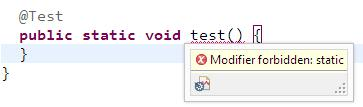
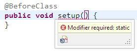
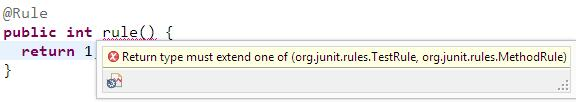

# JUnit Checker
[](https://travis-ci.org/XDean/junit-checker) 
[](https://maven-badges.herokuapp.com/maven-central/com.github.XDean/junit-checker)

Check JUnit annotation usage in compile period

This is also a sample of [deannotation-checker](https://github.com/XDean/Deannotation-checker)

# Motivation

Each JUnit annotation has different restrictions.

For example, `@Test` must annotated on 'public non-static void no-arg method', `@ClassRule` 
must annotated on 'public static TestRule method/field'.

Though JUnit will check it before run the tests, but how about check the usage in 
compile test?

# Usage

Depends on `junit-checker` in your project.

```xml
<dependency>
  <groupId>com.github.XDean</groupId>
  <artifactId>junit-checker</artifactId>
  <version>0.1.0-SNAPSHOT</version>
</dependency>
```

And then, it's done!

# Snapshot





